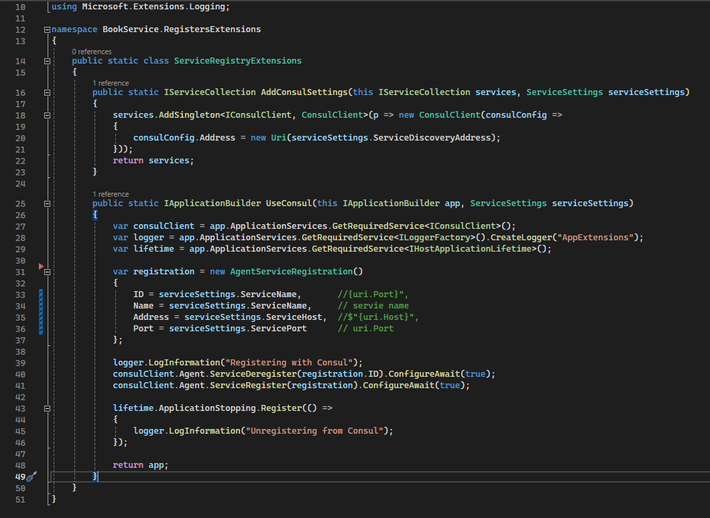
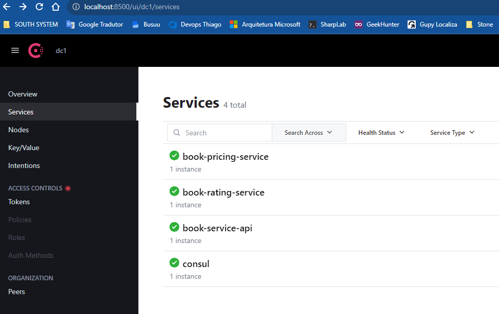

# API Gateway
Projeto de uma bookstore implementando um API Gateway usando o framework OCELOT

## Configuração do Arquivo Ocelot.Json
1. Upstream: para o OCELOT ele é o serviços que está acima de todos, por essa razão ele se entitulo de Upstream. 
Considerando essa definição, todas as configurações que começarem com Upstream estão referenciando ao serviços de ApiGateway
2. DownStream: como o OCELOT se considera o UP os Serviços APIs que estão abaixo dele são considerados DownStream, 
logo todas as configurações que começarem com esse prefixo é sobre o serviço de API.

Abaixo segue um exemplo da configuração

```json
{
  "Routes": [
    {
      "ServiceName": "",
      "DownstreamPathTemplate": "/users",
      "DownstreamScheme": "https",
      "DownstreamHostAndPorts": [
        {
          "Host": "jsonplaceholder.typicode.com",
          "Port": 443
        }
      ],
      "UpstreamPathTemplate": "/metadata/users",
      "UpstreamHttpMethod": [ "Get" ]
    }
}
```

### Descrição dos termos no arquivo de configuração

* **DownstreamPathTemplate**: Path para acessar o serviços do API
* **DownstreamScheme**: Define o protocolo que será utilizado. Normalmente `http` ou `http`
* **DownstreamHostAndPorts**: Define o host de destino e a porta do serviços que será utilizado:
* **UpstreamPathTemplate**: Path para orientar o OCELOT qual rota deve utilizar
* **UpstreamHttpMethod**: Verbo ou Método HTTP que será utilizado. Normalmente utilizado o `GET`, mas pode Ser `PUT, POST, DELETE` entre outros

``Obs.: O endereço do ServiçoAPI que será acessado é: https://jsonplaceholder.typicode.com/users`` 

A propriedade **ServiceName** dentre de `Routes` é utilizado para configurar o [Service Discovery](https://ocelot.readthedocs.io/en/latest/features/servicediscovery.html).
Como ainda não está utilizado o ServiceDisconvery é necessário que essa opção fique em branco.

## Agregação
Agregação é um mecanismo que existe no OCELOT que ele pode fazer varias requisições pelo cliente e agregar o resultados dessas
requisições em um novo obejto e retornar esse objeto completo.

Imagine a seguinte situação: Nós temos 3 serviços de API implementados: `Price, Book e Rating`. Para ter a informações completa
nosso serviço web precisaria fazer 3 requisições, uma para cada serviços. Depois precisaria pegar o resultado de cada consulta
e montar uma novo objeto para ter assim o Livro com preço e pontuação.

Para facilitar as coisa o OCELOT implementa essa funcionalidade de [Request Agregation](https://ocelot.readthedocs.io/en/latest/features/requestaggregation.html) para você.

Para configurar essa funcionalidade é necessário adicionar a tag `Aggregates` nas configurações conforme abaixo.

```json
{
  "Routes": [
    {
      "ServiceName": "",
      "DownstreamPathTemplate": "/api/books/{id}",
      "DownstreamScheme": "http",
      "DownstreamHostAndPorts": [
        {
          "Host": "book-service",
          "Port": 9001
        }
      ],
      "UpstreamPathTemplate": "/api/v1/books/{id}/details",
      "UpstreamHttpMethod": [ "Get" ],
      "Priority": 2,
      "Key": "Book"
    },

    {
      "ServiceName": "",
      "DownstreamPathTemplate": "/api/booksprices/{id}",
      "DownstreamScheme": "http",
      "DownstreamHostAndPorts": [
        {
          "Host": "pricing-service",
          "Port": 9002
        }
      ],
      "UpstreamPathTemplate": "/api/v1/books/{id}/price",
      "UpstreamHttpMethod": [ "Get" ],
      "Priority": 1,
      "Key": "BookPrice"
    },

    {
      "ServiceName": "",
      "DownstreamPathTemplate": "/api/booksratings/{id}",
      "DownstreamScheme": "http",
      "DownstreamHostAndPorts": [
        {
          "Host": "rating-service",
          "Port": 9003
        }
      ],
      "UpstreamPathTemplate": "/api/v1/books/{id}/ratings",
      "UpstreamHttpMethod": [ "Get" ],
      "Priority": 0,
      "Key": "BookRating"
    }
  ],
  "Aggregates": [
    {
      "RouteKeys": [
        "Book",
        "BookPrice",
        "BookRating"
      ],
      "UpstreamPathTemplate": "/api/v1/books/{id}/aggregated-details",
      "Aggregator": "BookDetailsAggregator"
    }
  ]
}
```

Observe acima que foi adicionado o grupo Aggregates e nele temos a configurações abaixo:

* **RouteKeys**: Chave dos roteamentos que serão chamado pelo rota de agregação
* **UpstreamPathTemplate**: path da rota que representa essa agregação
* **Aggregator**: Classe C# que será responsavel por representar a agregação. **O descrito aqui deve ser exatamente o mesmo nome utilizada na classe**;

Se você prestou atenção, nos rotas acima de cada um dos serviços API foi adicionado os seguintes parametros: `Priority e Key`.
Esse parametros representam a ordem em que as rotas serão chamadas e o nome da chave que será mencionado na agregação respectivamente.

Na Classe `BookDetailsAggregator` descrita abaixo, observe que é necessário implentar a interface `IDefinedAggregator` do ocelot
para que ele possa ser invocado quando a rota de agregação for acionado.

```csharp
 public class BookDetailsAggregator : IDefinedAggregator
    {
        public async Task<DownstreamResponse> Aggregate(List<HttpContext> responses)
        {
            var resultingAggregation = new ResultingAggregation<Book>();

            HttpResponseMessage response = new HttpResponseMessage();

            try
            {
                var book = await responses[0].Items.DownstreamResponse().Content.ReadAsAsync<Book>();

                try
                {
                    var price = await responses[1].Items.DownstreamResponse().Content.ReadAsAsync<BookPrice>();
                    var rating = await responses[2].Items.DownstreamResponse().Content.ReadAsAsync<BookRating>();

                    book.Stars = rating.Stars;
                    book.Price = price.Price;

                    resultingAggregation.Ok(book);
                }
                catch (Exception)
                {
                    resultingAggregation.Partial(book, "There was an error when loading Book DownStreams.");
                }
            }
            catch (Exception)
            {
                resultingAggregation.Error("There was error when loading the book details.");
            }

            response.Content = new ObjectContent<ResultingAggregation<Book>>(resultingAggregation, new JsonMediaTypeFormatter());

            return new DownstreamResponse(response);
        }
    }
```

Observe que é implementado o método `Aggregate` reponsavel por toda a lógica 
de agregação assim que as rotas da agregação terminarem o seu processo. Em seguida 
é redirecionado para esse método onde devemos remontar um Json e responder a agregação desejada.

Para maiors informações consultar a documentação oficial de [Request Aggregation](https://ocelot.readthedocs.io/en/latest/features/requestaggregation.html#basic-expecting-json-from-downstream-services)


## Configurando Projeto para rodar no Docker
Para facilitar nossos testes vamos iniciar a configuração do projeto no docker. Para tal faz se necessário criar os arquivos de configuração do docker.


Observe na imagem acima que foi adicionado o arquivo **DockerFile** em todos os projeto, inclusive no projetos `pricing-service` e `rating-service`. 
Também foi adicionado o arquivo `docker-compose-yml` e `.dockerignore`. 
> Atenção para o local que foi adicionado o arquivo `docker-compose.yml`

### Arquivo `Dockerfile` 

```docker
# Stage 1
FROM mcr.microsoft.com/dotnet/core/sdk:3.1 AS build
WORKDIR /build
EXPOSE 9001
COPY . .
RUN dotnet restore
RUN dotnet publish -c Release -o /app

# Stage 2
FROM mcr.microsoft.com/dotnet/core/aspnet:3.1 AS final
WORKDIR /app
COPY --from=build /app .
ENTRYPOINT ["dotnet", "book-service.dll"]
```

> Observer que está sendo exposto a porta 9001 que é a mesma porta configurada no API.
> Essa mesma configuração se repete para os demais serviços de API

### Arquivo docker-compose.yml

```shell
version: '3.7'
services:
  book-service-api:
    image: book-service:booktiq-apiservice
    build:
        context: ./src/book-service
        dockerfile: Dockerfile
    container_name: book-service

  pricing-service:
    image: pricing-service:booktiq-apiservice
    build: ./src/pricing-service
    container_name: pricing-service

  rating-service:
    image: book-rating:booktiq-apiservice
    build: ./src/rating-service
    container_name: rating-service

  api-gateway:
    image: api-gateway:booktiq-apiservice
    build: ./src/api-gateway
    container_name: api-gateway
    ports:
        - 9000:9000

  consul:
    image: consul:1.15.4
    container_name: "consul"
    hostname: "consul"
    ports:
        - 8500:8500
    command: agent -server -ui -node=server-1 -bootstrap-expect=1 -client=0.0.0.0
```
> Para entender a diferença entre build do serviço book-service e os demais acesso o [link](https://docs.docker.com/compose/compose-file/build/#attributes)

No arquivo `docker-compose` estamos defindo cada um dos serviços do projeto.
Observe que os únicos que estão com o parametros ports definido é `api-gateway` e `consul`, sendo assim são os únicos que poderam ser acessados externamento.

> O nome que é dado ao serviço no arquivo `docker-compose` deve ser o mesmo nome de serviço no arquivo de configuração do OCELOT.

```json
  "Routes": [
    {
      "ServiceName": "book-service-api",
      "LoadBalancerOptions": {
        "Type": "LeastConnection"
      },
      "DownstreamPathTemplate": "/api/books/{id}",
      "DownstreamScheme": "http",
      "UpstreamPathTemplate": "/api/v1/books/{id}/details",
      "UpstreamHttpMethod": [ "Get" ],
      "Priority": 2,
      "Key": "Book"
    },
```

Observe no trecho de configuração acima que a propriedade ServiceName da rota tem o exato nome do serviços no arquivo `docker-compose`.

O nome do serviço ==book-service-api== saiu do padrão justamente para explicar a relação entre a propriedade ==ServiceName do OCELOT== e nome do servico no ==docker-compose==

Caso queira executar o serviço do consul separadamente, utilize o comando abaixo:

`docker run -d -p 8500:8500 -p 8600:8600/udp --name=badger consul agent -server -ui -node=server-1 -bootstrap-expect=1 -client=0.0.0.0`

### Rodar projeto com docker-compose
Para executar o projeto com docker compose execute os comandos abaixo:
```bash
clear; docker compose down --remove-orphans --rmi local; docker compose up -d
```

Esse comando primeiro vai limpar a tela do prompt depois, vai tentar remover todos os serviços que estão listados nos docker-compose em seguida tenta criar as imagens e subir os containers.

## Configura o Service Discovery com CONSUL

Com já foi observado no arquivo ==docker-compose== estamos iniciando um container do Consul.
O ==Consul== será utilizado juntamente do ==OCELOT== para facilitar a descoberta de serviços na rede. 

Como os nossa api estão configuradas no docker e não temos controle de sua configuração de rede, fica mais dificil para nossas aplicação web acessarem esse serviços de api. 

Para resolver esse problema e não termos que mudar a configuração de nossos clientes toda vez que fizermos atualização de container de serviço API, iremos utilizar o ==CONSULT== para identificar esse novo container e deixa-lo acessivel a nossa ==API Gateway==

```json
{
      "ServiceName": "",
      "DownstreamPathTemplate": "/api/books/{id}",
      "DownstreamScheme": "http",
      "DownstreamHostAndPorts": [
        {
          "Host": "book-service",
          "Port": 9001
        }
      ],
      "UpstreamPathTemplate": "/api/v1/books/{id}/details",
      "UpstreamHttpMethod": [ "Get" ],
      "Priority": 2,
      "Key": "Book"
    },
```

Conforme pode ser visto no trecho de configuração do ocelot acima. Anteriomente quando tinhamos que configurar um novo serviços, tinhamos que definir o host e porta no serviço API. Como pode ser percebido no arquivo abaixo, com auxio do Serviço de Discoberta do Consul, não será mais necessário.

```json
"GlobalConfiguration": {
    "ServiceDiscoveryProvider": {
      "Scheme": "http",
      "Host": "consul",
      "Port": 8500,
      "Type": "Consul"
    }
  },
  "Routes": [
    {
      "ServiceName": "book-service-api",
      "LoadBalancerOptions": {
        "Type": "LeastConnection"
      },
      "DownstreamPathTemplate": "/api/books/{id}",
      "DownstreamScheme": "http",
      "UpstreamPathTemplate": "/api/v1/books/{id}/details",
      "UpstreamHttpMethod": [ "Get" ],
      "Priority": 2,
      "Key": "Book"
    }
  ]
}
```

Na seção de configuração das rotas das API agora só é necessário informar o `ServiceName` e o `LoadBalancerOptins` e também temos que fazer referencia ao ao Serviço de Discoberta na seção `GlobalConfiguration:ServiceDiscoveryProvider` 

Vale destacar que o parametro `host` e `type` possuem o mesmo nome porém com funcionalidade diferente:
* Host: serve para identificar o nome do serviço na rede que ira fazer o ServiceDiscovery. Essa configuração deve ser a mesma especificada no parametro `hostname` do `docker-compose`
* Type: serve para identificar qual dos tipo de serviço de descoberta suporta pelo OCELOT está sendo utilizando.

> Para maiores informações sobre como configurar o serviços de descoberta do OCELOT, consulte esse [link](https://ocelot.readthedocs.io/en/latest/features/servicediscovery.html#service-discovery).

Para finalizar a configuração do Serviço de API-Gateway faz-se necessário chamar o serviço na classe `Startup.cs` do projeto.


Daqui pra frente temos que configurar cada um dos serviços de API para se registrar no ==CONSUL== assim que forem iniciados.

### Configurações nos Serviços de API para registrar no Consult
A primeira coisa que temos que fazer é adicionar o pacote do Consul ao projeto. Para fazer isso você pode usar o comando abaixo
`dotnet add package Consul --version 1.6.1.1`


Deve ficar conforme apresentado na imagem acima.

Em seguida temos que realiar algumas configurações na aplicação conforme apresentado na imagem abaixo.


Na imagem acima estamos destacando quais os arquivos que sofreram alterações para efetuar a configuração de auto registro do serviços de API.

Abaixo iremos destar arquivo por arquivo e comentar os principais pontos de cada um.


No arquivo de Startup do projeto de API temos o destaque para o método ConfigureService onde adicionamos a extensão AddCOnsultSettings. Depois fazemos a chamado do serviço do Consul no método Configure passando a propriedade ServiceSettins que já foi instanciada no método ConfigureServices;



No método AddConsultSettings estamos adicionado ao container de injeção o endereço do serviço de discoberta.
No método UseConsult fazendo o registro do API no consul, e logando o que está ocorrendo;


Aqui na classe StartupBoostrapExtensions é feito a leitura das configurações feita no AppSettings.json e retorna para o método que o invocou.


```json
"ServiceSettings": {
    "ServiceName": "book-service",
    "ServiceHost": "localhost",
    "ServicePort": 9001,
    "ServiceDiscoveryAddress": "http://consul:8500"
  },
  "Logging": {
    "LogLevel": {
      "Default": "Information",
      "Microsoft": "Warning",
      "Microsoft.Hosting.Lifetime": "Information"
    }
  }
```

Acima é descrito a configuração do appsettings.development.json

```csharp
namespace BookService.Settings
{
    public class ServiceSettings
    {
        public string ServiceName { get; set; }
        public string ServiceHost { get; set; }
        public int ServicePort { get; set; }
        public string ServiceDiscoveryAddress { get; set; }
    }
}

A classe ServiceSettings é um representação em objeto das configurações feita no appsettings.development.json
```

Para acessar o Consul e verificar os serviços de API registrados, basta acessar a [url](http://localhost:8500/ui).

> Lembra que essa configuração deve ser replicada para cada um dos serviço de API da solução.



# Tecnologia
[Ocelot](https://github.com/ThreeMammals/Ocelot)
[Docker](https://docs.docker.com/develop/)
[Consul](https://developer.hashicorp.com/consul/tutorials/developer-discovery)
[.Net Core 3.1](https://learn.microsoft.com/pt-br/aspnet/core/introduction-to-aspnet-core?view=aspnetcore-8.0)